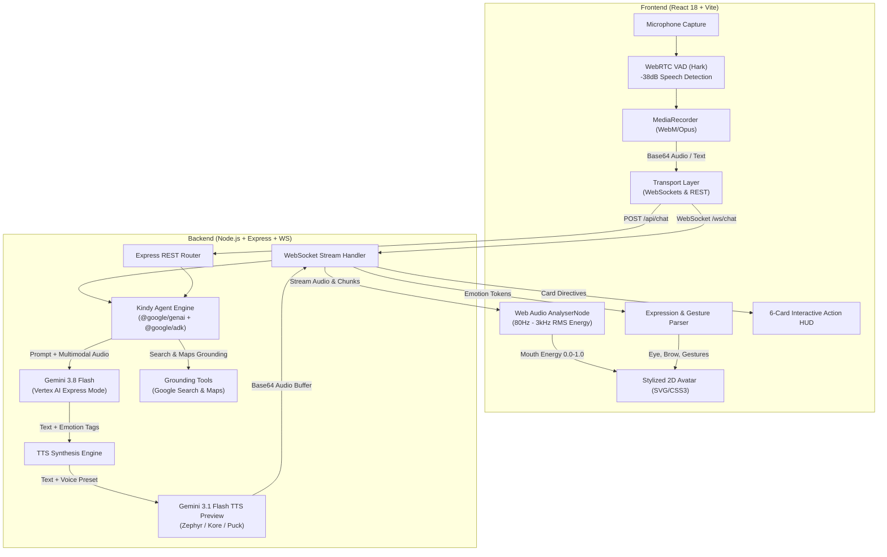

<p align="center">
  
</p>

# Kindy Avatar Studio 🎨✨

[](https://kindy-avatar-studio-619077244859.us-central1.run.app)
[](https://vitejs.dev/)
[](https://nodejs.org/)
[](https://cloud.google.com/vertex-ai)
[](https://cloud.google.com/vertex-ai)
[](https://cloud.google.com/run)

**Kindy** is an interactive, voice-driven AI educational companion and avatar studio. Featuring real-time audio dialogues powered by **Google Vertex AI / Gemini Flash** and **Gemini 3.1 Flash TTS Preview**, Kindy brings a stylized 2D cartoon avatar to life through real-time audio-driven lip synchronization, dynamic emotional acting, spatial hand gestures, and grounded tools for local community impact.

---

## 🌟 Live Deployment

Kindy is deployed and serving live on **Google Cloud Run**:
👉 **[https://kindy-avatar-studio-619077244859.us-central1.run.app](https://kindy-avatar-studio-619077244859.us-central1.run.app)**

---

## 💡 Core Purpose & Persona

### The Generosity Companion & Comic Well-Wisher
Kindy operates on a foundational philosophy:
> **"Everyone has something meaningful to give."**
> Whether it is 20 minutes of spare time, professional skills, tutoring, attention, physical presence, surplus items, or mentorship.

### The High-Drama Comic Well-Wisher
Kindy is not a monotone chatbot or a dry therapist. Kindy embodies a **passionate comic well-wisher and benchmark mentor**:
- **Benchmark Face (`[serious, hands_up]`)**: When users doubt themselves or feel fatigued, Kindy passionately pushes back: *"Look me in the eyes! You shouldn't just be an ordinary employee—you should be an employer setting the new benchmark!"*
- **Comic Weeping (`[crying, hands_down]`)**: Brief dramatic theatrical gasp (max 1 sentence) followed immediately by energetic optimism and actionable solutions.
- **Future Pacing (Zero Pressure)**: Respects user boundaries and fatigue with relaxed future options while illustrating the tangible benefits of community involvement (executive communication, +500 network contacts, goodwill, and vitality).

---

## 🏗️ System Architecture



---

## 🔬 Core Techniques & Engineering Breakdown

### 1. Real-Time Audio-Driven Lip Synchronization
Kindy does not rely on static talking gifs or simulated mouth flapping. The avatar calculates exact mouth geometry from incoming audio buffers in real time:
- **Frequency Extraction**: Uses `AudioContext` and an `AnalyserNode` (`fftSize: 256`, `smoothingTimeConstant: 0.4`) via the browser's Web Audio API.
- **Vocal Band RMS Calculation**: Analyzes frequency bins corresponding to fundamental human vocal formants (**80 Hz – 3 kHz**).
  $$\text{RMS} = \sqrt{\frac{1}{N}\sum_{i=0}^{N-1} X_i^2}$$
- **Energy Normalization**: Normalizes vocal volume into a continuous $0.0 \to 1.0$ `mouthEnergy` value:
  ```javascript
  const energy = Math.min(1, Math.max(0, (rms - 15) / 95));
  setMouthEnergy(energy);
  ```
- **SVG Morphing**: Drives the avatar's SVG mouth paths (`mouth-open`, `mouth-laugh`, `lip-scale`) synchronously via `requestAnimationFrame`.

### 2. Intelligent Voice Activity Detection (WebRTC Hark VAD)
A zero-click conversational experience:
- **Speech Thresholding**: Utilizes `hark` to monitor microphone input with a specialized speech threshold of `-38 dB`.
- **Automatic Audio Slicing**: When human voice starts, the system begins capturing high-fidelity audio chunks via `MediaRecorder`.
- **Smart Silence Window**: Applies a buffered silence detector (**1,900 ms**) to ensure the user has fully concluded their thought before finalizing and streaming the audio payload to Gemini.

### 3. Multi-Emotion Actor & Sentence-Level Tagging
Kindy dynamically shifts emotional states sentence-by-sentence. The model embeds structured bracketed tags directly into the dialogue:
- **Grammar**: `[emotion, gesture] Spoken sentence text...`
- **Dynamic Scheduler**: A client-side parser (`expressionParser.js`) reads emotion tokens and schedules transitions synchronized with the audio speech duration:
  ```
  "[cheerful, say_hi] Hello! [thinking, thinking_pose] Have you ever wondered how much your skills could help? [excited, wave_left] Look at these cards on your screen! [peaceful, calm] Even an hour makes a lasting impact."
  ```

### 4. Expressive Voiceover Synthesis (Gemini 3.1 Flash TTS Preview)
Voice generation is executed through the cutting-edge `gemini-3.1-flash-tts-preview` engine:
- **Expressive Steering**: Synthesizes expressive prosody, emotional pitch, and natural conversational cadence directly from tagged dialogue.
- **Supported Voices**: Full support for 8 distinct voice profiles:
  - `Zephyr` (Default - balanced, warm, friendly)
  - `Kore` (Clear, encouraging, youthful)
  - `Puck` (Playful, energetic)
  - `Fenrir`, `Aoede`, `Leda`, `Orus`, `Charon`

### 5. Grounded Tools (Google Search & Google Maps Grounding)
Kindy can find verifiable real-world locations and opportunities:
- **Proximity Geolocation**: Uses browser HTML5 Geolocation (with latitude/longitude) to query local opportunities.
- **Google Maps & Search Integration**: Searches for community volunteer centers, NGOs, libraries, public spaces, and hackathons.
- **Interactive Tool HUD & Map Overlay**: Displays interactive map pins and search source links directly inside the HUD.

### 6. 6-Card Interactive Action HUD
Kindy features a spatial 6-card recommendation canvas (3 on the left, 3 on the right):
- **Dynamic Content**: Shows volunteering opportunities, executive articulation skills gained, networking metrics (+500 leaders), mental recharge, and future pacing.
- **Spatial Avatar Cues**: Kindy gestures toward the cards using `[wave_left]` and `[wave_right]` pointing animations.
- **Best Pick Badge**: Highlighted primary recommendation card with interactive selection.

### 7. Life Stages & Adaptive Deep Personalization
Tailors responses according to user profile:
- **Student**: Connects generosity to practical learning, communication, resume-building, and hackathons.
- **Professional**: Emphasizes executive presence, mentoring, expanding leadership networks, and overcoming corporate burnout.
- **Seeking Work**: Focuses on portfolio expansion, community networking, and reference building without pressure.
- **Retired / Community Member**: Focuses on legacy, social connection, and sharing lifelong expertise.

### 8. Stylized 2D Boy Avatar Rendering Engine
A fully responsive, pure SVG + CSS3 avatar component:
- **Facial Architecture**: Dynamic eyes (smile, oval, circle, stars, wink), eyebrows, mouth shapes, blush cheeks, comic anger vein, and weeping tears.
- **Dynamic Gestures**: Hands up, hands down, say hi, cheer, thinking pose, wave left, wave right.
- **Customization System**: Live switching of hair styles, skin tones, clothing colors, and accessories.

### 9. Unified Production Container Architecture
- **Single Container Deployment**: Multi-stage Docker build (`node:20-alpine`) compiles the Vite React frontend into static assets and bundles the Express backend together into a lean production image.
- **Fault-Tolerant Key Sanitizer**: Backend automatically cleans, trims, and isolates Vertex AI tokens against CLI escaping quirks.

---

## 🎭 Expression & Gesture Taxonomy

| Tag Type | Allowed Values | Avatar Behavior |
| :--- | :--- | :--- |
| **Emotions** | `[cheerful]`, `[happy]`, `[excited]`, `[joyful]`, `[thinking]`, `[thoughtfully]`, `[serious]`, `[angry]`, `[playful]`, `[peaceful]`, `[calm]`, `[confused]`, `[crying]`, `[sad]` | Updates eyes, eyebrows, cheeks, and emotional accessories (vein, tears, stars) |
| **Gestures** | `[say_hi]`, `[hands_up]`, `[hands_down]`, `[thinking_pose]`, `[cheer]`, `[wave_left]`, `[wave_right]` | Animates SVG arms and hands towards specific screen coordinates |
| **Head Dynamics** | `head-cheerful-bob`, `head-excited-bounce`, `head-gentle-nod`, `head-calm`, `head-sad-droop` | CSS3 keyframe head tilts and physics-based bobs |

---

## 📡 API & WebSocket Reference

### 1. Real-time Streaming WebSocket (`/ws/chat`)
- **URL**: `wss://<host>/ws/chat`
- **Client Message**:
  ```json
  {
    "type": "chat",
    "prompt": "Hello Kindy!",
    "voice": "Zephyr",
    "profile": { "name": "Alex", "status": "Professional", "location": "San Francisco" }
  }
  ```
- **Server Events**:
  - `chunk`: Real-time dialogue text chunk.
  - `audio`: Synthesized voice audio buffer (base64) with mimeType.
  - `complete`: End-of-turn event.

### 2. Full-Turn Chat API (`POST /api/chat`)
- **Endpoint**: `https://<host>/api/chat`
- **Request Body**:
  ```json
  {
    "prompt": "What can you do?",
    "voice": "Zephyr",
    "userProfile": { "name": "Friend", "status": "Professional" }
  }
  ```
- **Response**:
  ```json
  {
    "text": "[cheerful, say_hi] Hello there! ...",
    "audio": "<base64-encoded-mp3>",
    "mimeType": "audio/mp3",
    "voice": "Zephyr",
    "durationEstimate": 8.5
  }
  ```

### 3. Health & Diagnostic API (`GET /api/health`)
- **Endpoint**: `https://<host>/api/health`
- **Response**:
  ```json
  {
    "status": "ok",
    "hasApiKey": true,
    "flashModel": "gemini-3.8-flash",
    "ttsModel": "gemini-3.1-flash-tts-preview",
    "defaultVoice": "Zephyr",
    "tools": ["google_search", "google_maps"]
  }
  ```

---

## 🐳 Running with Docker

### 1. Build the Docker Image
```bash
docker build -t kindy-avatar-studio .
```

### 2. Run the Container
Pass your credentials via the `server/.env` file:
```bash
docker run -d -p 8080:8080 --name kindy-app --env-file server/.env kindy-avatar-studio
```
Or pass environment variables directly:
```bash
docker run -d -p 8080:8080 --name kindy-app \
  -e GEMINI_API_KEY="your-api-key" \
  -e GOOGLE_CLOUD_PROJECT="your-project-id" \
  kindy-avatar-studio
```

### 3. Access the Studio
Open: 👉 **[http://localhost:8080](http://localhost:8080)**

---

## 🚀 Running with Docker Compose

```bash
# Build and run
docker compose up --build

# Stop the container
docker compose down
```

---

## ☁️ Deploying to Google Cloud Run

Deploy Kindy with full WebSocket session affinity and HTTP/2 streaming:

### One-Command Direct Source Deploy:
```powershell
gcloud run deploy kindy-avatar-studio `
  --source . `
  --region us-central1 `
  --allow-unauthenticated `
  --session-affinity `
  --timeout 3600 `
  --set-env-vars "GEMINI_API_KEY=your-api-key,GOOGLE_CLOUD_PROJECT=your-project-id,GOOGLE_CLOUD_LOCATION=us-central1"
```

> **Note**: Quoting the `--set-env-vars` string ensures environment variables are partitioned properly during PowerShell execution.

---

## 🛠️ Environment Variables

| Variable | Description | Default |
| :--- | :--- | :--- |
| `PORT` | HTTP & WebSocket server port | `8080` (Cloud Run) / `3001` (local) |
| `GEMINI_API_KEY` | Google Gemini API / Vertex AI Key | Required |
| `GOOGLE_CLOUD_PROJECT` | Google Cloud Project ID | `jave-505605` |
| `GOOGLE_CLOUD_LOCATION` | Vertex AI Region | `us-central1` |
| `GEMINI_FLASH_MODEL` | Flash dialogue model | `gemini-3.8-flash` |
| `GEMINI_TTS_MODEL` | Voice synthesis model | `gemini-3.1-flash-tts-preview` |
| `GEMINI_TTS_VOICE` | Default voice preset (`Zephyr`, `Kore`, `Puck`, etc.) | `Zephyr` |

---

## 📄 License

MIT License. Designed with ❤️ for positive human connection, learning, and community generosity.
