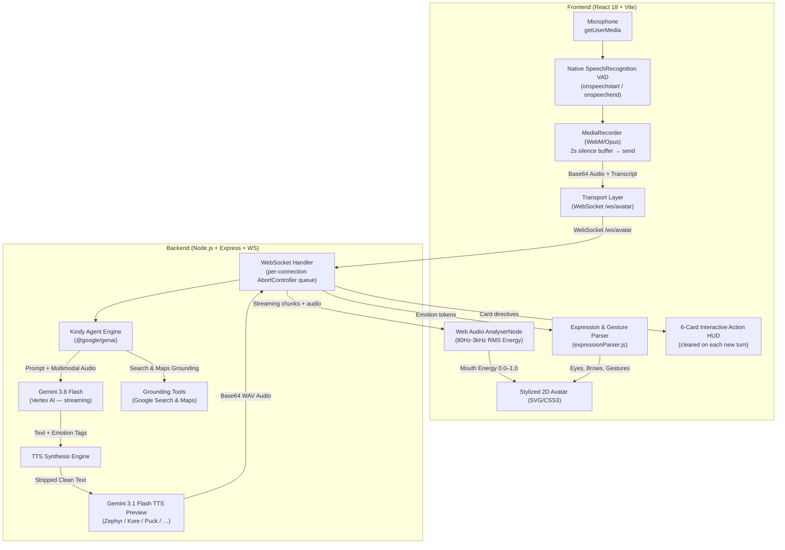

<p align="center">
  
</p>

# Kindy — The Generosity Companion 🎨✨

[](https://kindy-avatar-studio-619077244859.us-central1.run.app)
[](https://youtu.be/jI_YRfRIlqo)
[](https://vitejs.dev/)
[](https://nodejs.org/)
[](https://cloud.google.com/vertex-ai)
[](https://cloud.google.com/vertex-ai)
[](https://cloud.google.com/run)

**Kindy** is a real-time, voice-driven AI companion and avatar studio. Powered by **Google Gemini 3.8 Flash** and **Gemini 3.1 Flash TTS**, it brings a stylized 2D cartoon avatar to life through audio-driven lip sync, multi-emotion acting, spatial hand gestures, Google Search & Maps grounding, and a 6-card interactive action HUD.

---

## 🌟 Live Deployment & Demo Video

- 🌐 **Live Web Application**: **[https://kindy-avatar-studio-619077244859.us-central1.run.app](https://kindy-avatar-studio-619077244859.us-central1.run.app)**
- 🎬 **Video Walkthrough (YouTube)**: **[Watch the Demo Video](https://youtu.be/jI_YRfRIlqo)**

[](https://youtu.be/jI_YRfRIlqo)

---

## 💡 Core Purpose & Persona

### The Generosity Companion & Comic Well-Wisher
Kindy operates on a simple philosophy:
> **"Everyone has something meaningful to give."**
> Whether it is 20 minutes of spare time, professional skills, tutoring, attention, physical presence, surplus items, or mentorship.

### The High-Drama Comic Well-Wisher
Kindy is not a monotone chatbot. It embodies a **passionate comic well-wisher and benchmark mentor**:
- **Benchmark Face (`[serious, hands_up]`)**: When users doubt themselves, Kindy pushes back passionately: *"Look me in the eyes! You shouldn't just be an ordinary employee — you should be an employer setting the new benchmark!"*
- **Comic Weeping (`[crying, hands_down]`)**: A brief theatrical gasp (max 1 sentence) followed immediately by energetic optimism.
- **Future Pacing (Zero Pressure)**: Respects boundaries and fatigue with relaxed future options while illustrating tangible personal benefits.

---

## 🏗️ System Architecture



---

## 🔬 Core Techniques & Engineering

### 1. Native Browser VAD (Voice Activity Detection)
Kindy uses the **browser's built-in `SpeechRecognition` API** as its voice activity detector — the same engine used by ChatGPT Voice, Gemini Live, and all major AI voice apps:

| Event | Action |
|:---|:---|
| `onspeechstart` | Immediately start `MediaRecorder` capture |
| `onspeechend` | Wait **2 s** silence buffer → stop recorder → send to Gemini |
| `onresult` | Stream live caption text as user speaks |
| `onend` | Auto-restart recognition (Chrome resets every ~60 s) |

**No third-party VAD library required.** Hardware-level accuracy with zero false positives from fan noise, keyboard clicks, or ambient room noise.

### 2. Real-Time Audio-Driven Lip Synchronization
Kindy calculates exact mouth geometry from incoming TTS audio buffers in real time:
- **Frequency Extraction**: `AudioContext` + `AnalyserNode` (`fftSize: 256`, `smoothingTimeConstant: 0.4`)
- **Vocal Band RMS**: Analyzes frequency bins for fundamental human speech formants (**80 Hz – 3 kHz**)

$$\text{RMS} = \sqrt{\frac{1}{N}\sum_{i=0}^{N-1} X_i^2}$$

- **Energy Normalization**: Normalizes into a continuous `0.0 → 1.0` `mouthEnergy` value
- **SVG Morphing**: Drives avatar mouth paths synchronously via `requestAnimationFrame`

### 3. Per-Connection Request Queue (Anti-Blockage)
The WebSocket server uses an **`AbortController`-based sequential queue** per client connection:
- If a **new voice message arrives** while a previous one is still streaming, the old request is **cancelled immediately**
- The new request starts right away — no waiting, no stale responses, no interleaved chunks
- Each `safeSend()` call checks `abortSignal.aborted` before writing to the socket

### 4. Tab-Switch Mic Recovery
When the user switches to another browser tab and returns:
1. `visibilitychange` → `stopVoiceCapture()` clears all refs
2. On return, `isListeningRef` is force-reset to `false`
3. A **300 ms delay** lets the browser restore mic permissions
4. `SpeechRecognition.onend` auto-clears `speechRecRef` so a fresh instance is always created
5. MediaStream tracks are validated (`readyState === 'live'`) before reuse — stale streams get replaced

### 5. Multi-Emotion Actor & Sentence-Level Tagging
Kindy dynamically shifts emotional states sentence-by-sentence using structured bracketed tags:
```
[cheerful, say_hi] Hello! [thinking, thinking_pose] Have you wondered how much your skills could help?
[excited, wave_left] Look at these cards! [peaceful, calm] Even an hour makes a lasting impact.
```
A client-side `expressionParser.js` reads tokens and schedules transitions synchronized with TTS audio duration.

### 6. Expressive Voiceover Synthesis (Gemini 3.1 Flash TTS)
- **Expressive Prosody**: Synthesizes natural emotional pitch and cadence from tagged dialogue
- **Card & tag stripping**: `stripCardsAndTags()` removes all `[emotion]`, `[cards: [...]]` tokens before TTS
- **Supported voices**: `Zephyr` · `Kore` · `Puck` · `Fenrir` · `Aoede` · `Leda` · `Orus` · `Charon`

### 7. Google Search & Maps Grounding
- **Real-world locations**: Searches for community volunteer centers, NGOs, libraries, and hackathons near the user
- **Streaming grounding metadata**: Extracts `webSearchQueries` and `groundingChunks` from streaming responses
- **Interactive Tool HUD**: Displays map pins, search source citations, and interactive waypoint chips

### 8. 6-Card Interactive Action HUD
- **Dynamic content**: Volunteering spots, impact metrics, executive skill gains, network stats
- **Cleared on each new turn**: Cards are reset at the start of every new voice request
- **Spatial avatar cues**: Kindy gestures toward cards using `[wave_left]` / `[wave_right]`
- **Slide-in animation**: Cards animate smoothly in/out of the dock

### 9. Life Stages & Deep Personalization
| Stage | Focus |
|:---|:---|
| **Student** | Learning, communication, resume-building, hackathons |
| **Professional** | Executive presence, mentoring, network expansion, burnout recovery |
| **Seeking Work** | Portfolio expansion, community networking, reference building |
| **Retired / Community** | Legacy, social connection, sharing expertise |

### 10. Production Container Architecture
- **Single container**: Multi-stage Docker build (`node:20-alpine`) — Vite frontend compiled to static assets + Express backend in one lean image
- **Cloud Run optimized**: `--session-affinity` ensures WebSocket clients stick to one instance; `--timeout 3600` supports long-lived connections

---

## 🎭 Expression & Gesture Taxonomy

| Tag Type | Allowed Values | Avatar Behavior |
| :--- | :--- | :--- |
| **Emotions** | `[cheerful]` `[happy]` `[excited]` `[joyful]` `[thinking]` `[thoughtfully]` `[serious]` `[angry]` `[playful]` `[peaceful]` `[calm]` `[confused]` `[crying]` `[sad]` | Updates eyes, brows, cheeks, tears, anger vein, star eyes |
| **Gestures** | `[say_hi]` `[hands_up]` `[hands_down]` `[thinking_pose]` `[cheer]` `[wave_left]` `[wave_right]` | Animates SVG arms and hands |
| **Head Dynamics** | `head-cheerful-bob` `head-excited-bounce` `head-gentle-nod` `head-calm` `head-sad-droop` | CSS3 keyframe physics bobs and tilts |

---

## 📡 API & WebSocket Reference

### 1. Real-Time Streaming WebSocket (`/ws/avatar`)
- **URL**: `wss://<host>/ws/avatar`
- **Client Message (voice)**:
  ```json
  {
    "type": "audio",
    "audioBase64": "<base64-webm-opus>",
    "mimeType": "audio/webm",
    "prompt": "optional transcript text",
    "voice": "Zephyr",
    "history": [],
    "userProfile": { "name": "Alex", "status": "Professional", "location": "Hyderabad" }
  }
  ```
- **Client Message (text)**:
  ```json
  { "type": "prompt", "prompt": "Hello Kindy!", "voice": "Zephyr", "history": [] }
  ```
- **Server Events**:
  | Event | Payload |
  |:---|:---|
  | `chunk` | `{ text, accumulated }` — streaming dialogue token |
  | `tool_call` | `{ tool, name, query, status }` — Google Search / Maps activated |
  | `search_complete` | `{}` — grounding finished |
  | `grounding_sources` | `{ sources[] }` — citation links |
  | `cards` | `{ cards[] }` — LLM-generated recommendation cards |
  | `clear_cards` | `{}` — dismiss cards from screen |
  | `audio` | `{ audioBase64, mimeType, durationEstimate, voice }` — TTS result |
  | `done` | `{ fullText }` — turn complete |
  | `error` | `{ error }` — processing failure |

### 2. Full-Turn Chat API (`POST /api/chat`)
```json
// Request
{ "prompt": "What can I do?", "voice": "Zephyr", "userProfile": { "name": "Friend" } }

// Response
{ "text": "[cheerful, say_hi] Hello...", "audio": "<base64-wav>", "mimeType": "audio/wav", "voice": "Zephyr", "durationEstimate": 8.5 }
```

### 3. Health Check (`GET /api/health`)
```json
{ "status": "ok", "hasApiKey": true, "flashModel": "gemini-3.8-flash", "ttsModel": "gemini-3.1-flash-tts-preview", "defaultVoice": "Zephyr", "tools": ["google_search", "google_maps"] }
```

---

## 🐳 Running with Docker

```bash
# Build
docker build -t kindy-avatar-studio .

# Run with env file
docker run -d -p 8080:8080 --name kindy-app --env-file server/.env kindy-avatar-studio

# Or pass env vars directly
docker run -d -p 8080:8080 --name kindy-app \
  -e GEMINI_API_KEY="your-api-key" \
  -e GOOGLE_CLOUD_PROJECT="your-project-id" \
  kindy-avatar-studio
```

Open: 👉 **[http://localhost:8080](http://localhost:8080)**

---

## 🚀 Running with Docker Compose

```bash
docker compose up --build
docker compose down
```

---

## ☁️ Deploying to Google Cloud Run

```powershell
gcloud run deploy kindy-avatar-studio `
  --source . `
  --region us-central1 `
  --allow-unauthenticated `
  --session-affinity `
  --timeout 3600 `
  --set-env-vars "GEMINI_API_KEY=your-api-key,GOOGLE_CLOUD_PROJECT=your-project-id,GOOGLE_CLOUD_LOCATION=us-central1"
```

> **Note**: `--session-affinity` is required to keep WebSocket clients pinned to the same Cloud Run instance.

---

## 🛠️ Environment Variables

| Variable | Description | Default |
| :--- | :--- | :--- |
| `PORT` | HTTP & WebSocket server port | `8080` |
| `GEMINI_API_KEY` | Google Gemini / Vertex AI API Key | **Required** |
| `GOOGLE_CLOUD_PROJECT` | Google Cloud Project ID | — |
| `GOOGLE_CLOUD_LOCATION` | Vertex AI region | `us-central1` |
| `GEMINI_FLASH_MODEL` | Dialogue model | `gemini-3.8-flash` |
| `GEMINI_TTS_MODEL` | Voice synthesis model | `gemini-3.1-flash-tts-preview` |
| `GEMINI_TTS_VOICE` | Default voice preset | `Zephyr` |

---

## 📄 License

MIT License. Designed with ❤️ for positive human connection, learning, and community generosity.
